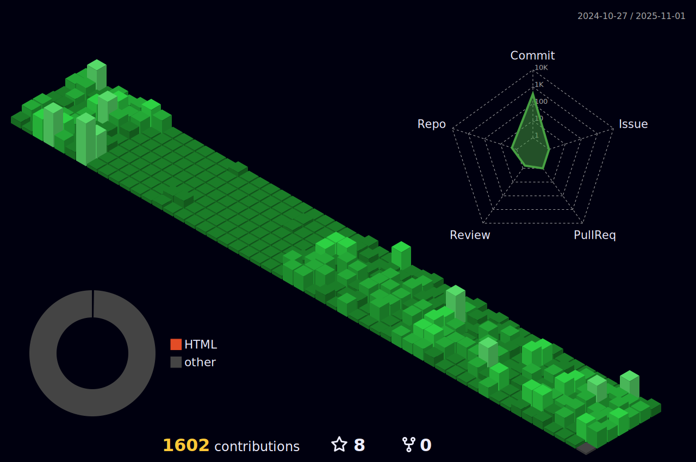

<h1 align="center">Hi 👋, I'm xander</h1>
<h3 align="center">A Nodejs and Python developer</h3>

  

  

  

- 🔭 I’m currently working on [Afrak](https://afrak.com)

- 🌱 I’m currently learning **Golang**

- 💬 Ask me about **nodejs**

<h3 align="left">Connect with me:</h3>

<h3 align="left">Languages and Tools:</h3>

                        

